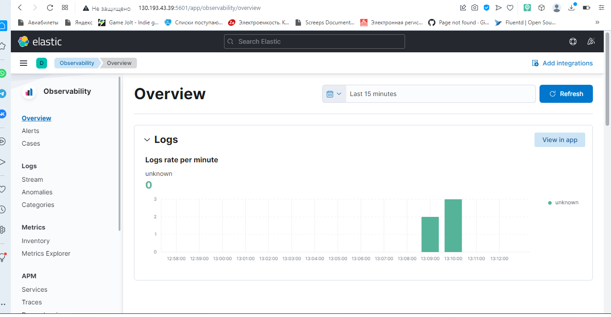

# Домашнее задание к занятию 11.3. «ELK» - "Ruslan Serebryakov"

### Задание 1. Elasticsearch 

Установите и запустите Elasticsearch, после чего поменяйте параметр cluster_name на случайный. 

*Приведите скриншот команды 'curl -X GET 'localhost:9200/_cluster/health?pretty', сделанной на сервере с установленным Elasticsearch. Где будет виден нестандартный cluster_name*.

---

### Задание 2. Kibana

Установите и запустите Kibana.

*Приведите скриншот интерфейса Kibana на странице http://<ip вашего сервера>:5601/app/dev_tools#/console, где будет выполнен запрос GET /_cluster/health?pretty*.

---

### Задание 3. Logstash

Установите и запустите Logstash и Nginx. С помощью Logstash отправьте access-лог Nginx в Elasticsearch. 

*Приведите скриншот интерфейса Kibana, на котором видны логи Nginx.*

Несколько дней я потратил на то, чтобы разобраться что к чему. Я запускал это на виртуалке, в облаке, в другом облаке, купил SSD и попробовал развернуть на своей хостовой машине.
Попробовал на ноуте всё поднять, общался с одногруппниками - обсуждали с ними как кто решил. И вот спустя десяток гайдов и 2-х индусов на ютубе - обсудив ситуацию с одногруппником я начал читать ЛОГИ и фиксить ошибки. 
Мораль этих попыток проста - читайте логи, старайтесь :)

---

### Задание 4. Filebeat. 

Установите и запустите Filebeat. Переключите поставку логов Nginx с Logstash на Filebeat. 

*Приведите скриншот интерфейса Kibana, на котором видны логи Nginx, которые были отправлены через Filebeat.*

## Дополнительные задания (со звёздочкой*)
Эти задания дополнительные, то есть не обязательные к выполнению, и никак не повлияют на получение вами зачёта по этому домашнему заданию. Вы можете их выполнить, если хотите глубже шире разобраться в материале.

### Задание 5*. Доставка данных 

Настройте поставку лога в Elasticsearch через Logstash и Filebeat любого другого сервиса , но не Nginx. 
Для этого лог должен писаться на файловую систему, Logstash должен корректно его распарсить и разложить на поля. 

*Приведите скриншот интерфейса Kibana, на котором будет виден этот лог и напишите лог какого приложения отправляется.*
